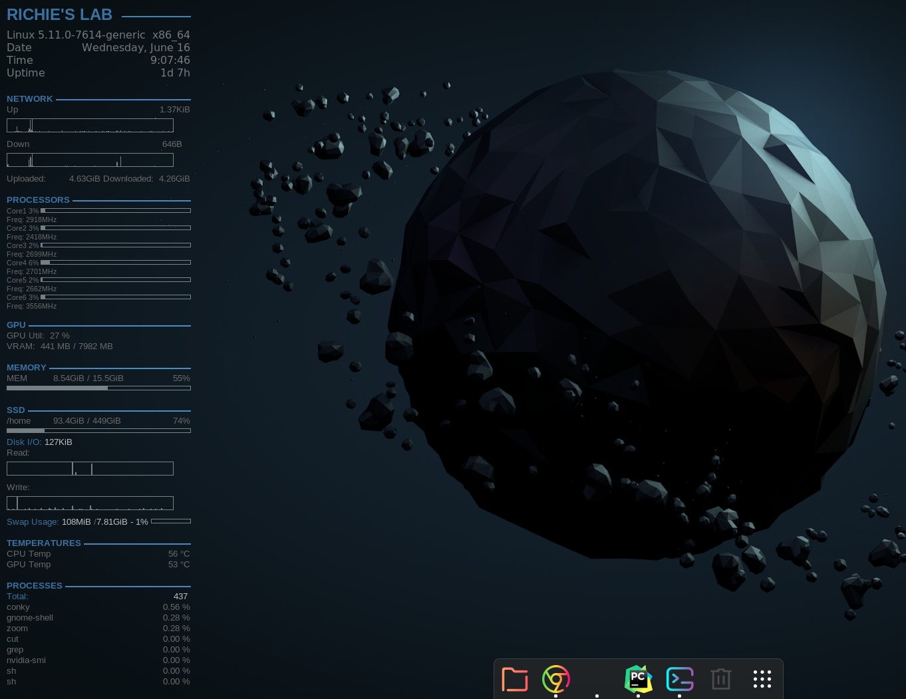

# Richie's custom Conky setup

## What is conky?
If you're like me, I'm always curious to know which programs are taking up the resources, whether temps are normal, if there is network activities... and many more.  

Conky is a system monitor tool that overlays on your desktop can do everything I mentioned and more! With a bit of customization, it can also look aesthetic.

I get asked a lot on how I customize my desktop environment, so I prepared a short guide to replicate the conky setup (also for my future reference for my never-ending linux re-installation :P)

Here is a snapshot of my desktop with Conky activated!



## Installation
Simply run
```bash
sudo apt-get -y install conky-all
```

then you can run
```bash
conky
```

## (Optional) Changing the look
### Conky
What you see initially might be rather unappealing, but worry not! We just need to customize it a bit.

This might look daunting but you just need to tweak a little bit to get up and running.

First, open conky.conf in your IDE, and unless your name is also Richie, you should change the name. Go to line 48 to change main title name 


For network portion, run `ifconfig` to check which wireless / ethernet you want to track. For wifi, it'll usually start with wlp, and enp for ethernet. You can later check to see if there's any network activity to ensure it's set up correctly.

For example, my wifi is wlp62s0 so it looks like this. Replace wlp62s0 with your corresponding wifi / ethernet.


My machine has 6 cores, but your machine might have more / less. You can run `lscpu` to check how many cores your CPU has.
You can edit the processor tracking line 64 accordingly.


If your system does not have GPU, then you can remove the GPU section entirely.


If you do not have swap set up, you can also remove the Swap Usage part.


afterwards, time to apply our new changes
```bash
sudo mv conky.conf /etc/conky/
```

### dash to dock
Go to this [link](https://extensions.gnome.org/extension/307/dash-to-dock/) and toggle the switch, enter your password and you're good to go! You can also right-click the new dock and set its position, etc.


### Icons
There are a ton of icon themes for gnome desktop. One of my favorite is [Reversal](https://github.com/yeyushengfan258/Reversal-icon-theme) and [Win10Sur](https://github.com/yeyushengfan258/Win10Sur-icon-theme)

Go to the link, download the repo and simply run ./install.sh in the project as instructed.

Now open tweaks from applications menu (if you don't have it installed, just run `sudo apt install gnome-tweak-tool`) -> Appearance -> Icons and you can select the installed icon theme!


## Post-installation
To make conky start on boot on Ubuntu20.04, simply go to Startup Application Preferences -> Add and add conky.

 